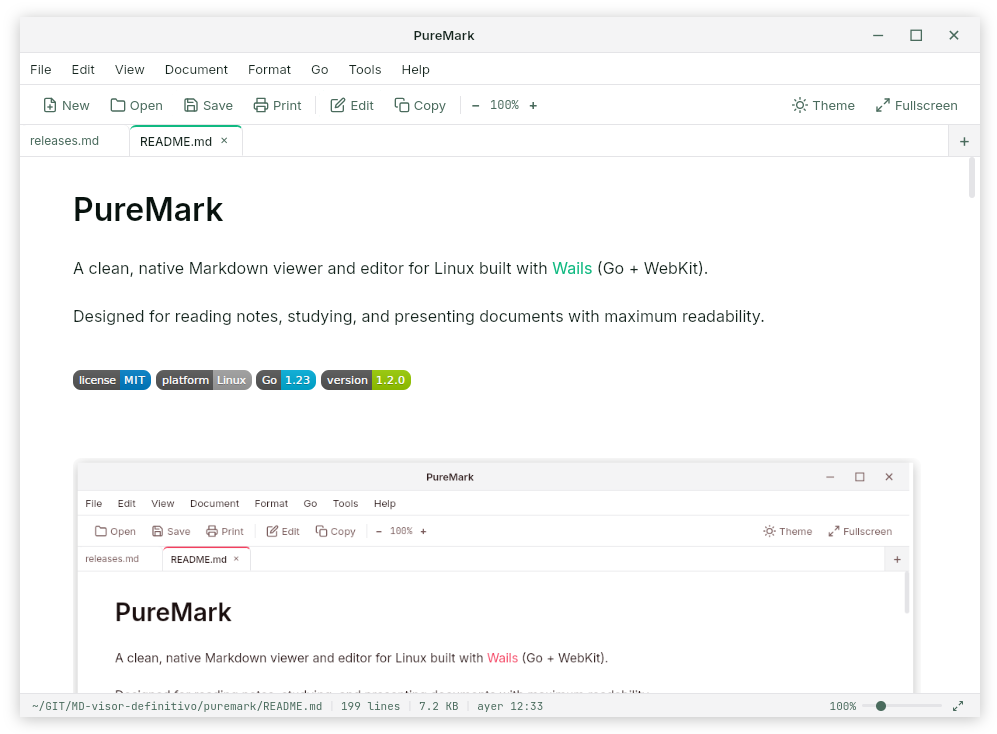

# PureMark

A clean, native Markdown viewer and editor for Linux built with [Wails](https://wails.io) (Go + WebKit).

Designed for reading notes, studying, and presenting documents with maximum readability.

   



## Features

### Viewing & Rendering
- **Native file association** — Double-click any `.md` file to open it instantly
- **Elegant rendering** — Markdown to HTML with clean typography (Inter + JetBrains Mono)
- **Syntax highlighting** — Code blocks with highlight.js, colors adapt to each theme
- **Local images** — ``, `img.png` and `/abs/path.png` are resolved against the document folder and served by an internal same-origin handler (no `file://` issues)
- **Rich text copy** — Copy rendered content as `text/html` + `text/plain` for pasting into Word, email, etc.
- **Find in document** — `Ctrl+F` opens a floating search bar with next/previous navigation in both rendered view and edit mode
- **Print support** — Optimized `@media print` CSS with page-break control
- **Export as PDF** — Native PDF export using system browser (headless), forced light mode
- **Export as HTML** — Self-contained HTML with inline styles and syntax highlighting

### Editing
- **Edit mode** — Toggle between view and edit with `Ctrl+E`
- **Inline formatting toolbar** — Bold, Italic, Strikethrough, Headings (H1–H4), Quote, Lists (bullet, numbered, task), Links, Images, Tables, Horizontal rule, Code (inline and block)
- **Smart formatting** — Place your cursor on a word and apply formatting; it wraps the whole word automatically
- **Full undo / redo** — `Ctrl+Z` / `Ctrl+Y` with custom undo stack (native undo unreliable in WebKitGTK)
- **Unsaved changes protection** — Prompts to save before closing if there are pending edits

### Multi-Tab
- **Tabbed interface** — Open multiple files simultaneously
- **Per-tab state** — Each tab maintains its own content, mode, undo/redo stack, and dirty flag
- **Tab bar with scroll** — Horizontal scrolling with arrows and mouse wheel when many tabs are open
- **Quick open button** — `+` button on the tab bar to open new files
- **Drag & Drop** — Drop `.md` files onto the window to open them as new tabs

### File Management
- **New file** — Create untitled documents with `Ctrl+N`
- **Save as** — Save to new location with `Ctrl+Shift+S`
- **Export as PDF** — Direct PDF generation without print dialog (uses system browser headless)
- **Export as HTML** — Self-contained HTML files with inline CSS and syntax highlighting
- **Fullscreen Zen Mode** — Hide all UI except tabs and content for immersive reading (configurable)
- **Single instance** — Opening multiple files from the file manager stacks them as tabs in the existing window
- **External change detection** — Files edited by other programs are reloaded silently when clean, or surface a non-modal *Reload / Keep my changes* banner when dirty

### UI & Customization
- **9 color themes** — Default, Nord, Solarized, Dracula, Rosé Pine, Catppuccin, Oceanic, Sunset Coral, Emerald
- **Light / Dark mode** — Per-theme toggle with one click
- **Zoom controls** — `Ctrl++`, `Ctrl+-`, `Ctrl+0`, `Ctrl+Mouse Wheel`, and status bar slider
- **Frameless window** — Clean look with custom title bar and window controls
- **Full menu bar** — File, Edit, View, Document, Format, Go, Tools, Help
- **Document tools** — File information dialog, word count, jump to top/bottom, keyboard shortcuts, and About dialog
- **Context menu** — Right-click for Cut, Copy, Paste, Copy as Rich Text, Select All
- **Status bar** — File path, line count, file size, modification date, zoom slider, fullscreen toggle
- **Multi-language UI** — Spanish and English
- **Preferences persistence** — Theme, color scheme, language, zoom level remembered across sessions

### System Integration
- **`.deb` package** with automatic desktop entry, icon registration, and MIME type association
- **CLI support** — Open files directly from terminal: `puremark file.md`
- **Multiple file arguments** — `puremark file1.md file2.md` opens both in tabs

## Installation

### Option A: `.deb` package (recommended)

PureMark 1.2.0 is published in two WebKit variants. Pick the package that matches the WebKit version shipped by your distribution:

| Package | Distro | WebKit ABI |
|---|---|---|
| `puremark_1.2.0_amd64.deb` | Linux Mint 21, Ubuntu 22.04, Debian 12 | `libwebkit2gtk-4.0-37` |
| `puremark_1.2.0_amd64_webkit41.deb` | Linux Mint 22, Ubuntu 24.04 | `libwebkit2gtk-4.1-0` |

If you are not sure, check which runtime library is available:

```bash
apt-cache policy libwebkit2gtk-4.0-37 libwebkit2gtk-4.1-0
```

Use the 4.0 package when your system has `libwebkit2gtk-4.0-37`. Use the 4.1 package when it has `libwebkit2gtk-4.1-0`.

Download from [Releases](https://github.com/soyunomas/puremark/releases) and install:

```bash
sudo dpkg -i puremark_1.2.0_amd64.deb          # WebKitGTK 4.0
# or
sudo dpkg -i puremark_1.2.0_amd64_webkit41.deb # WebKitGTK 4.1
```

This will:
- Install the binary to `/usr/local/bin/puremark`
- Register PureMark as the default viewer for `.md` files
- Add the application icon and desktop entry

To uninstall:

```bash
sudo dpkg -r puremark
```

### Option B: Build from source

#### Prerequisites

- [Go](https://go.dev/dl/) 1.23+
- [Node.js](https://nodejs.org/) 18+
- [Wails CLI](https://wails.io/docs/gettingstarted/installation) v2
- WebKit2GTK dev libraries — pick the one your distro ships:

```bash
# Mint 21 / Ubuntu 22.04 / Debian 12
sudo apt install libwebkit2gtk-4.0-dev libgtk-3-dev

# Mint 22 / Ubuntu 24.04
sudo apt install libwebkit2gtk-4.1-dev libgtk-3-dev
```

Verify your environment:

```bash
wails doctor
```

#### Build & Install

```bash
git clone https://github.com/soyunomas/puremark.git
cd puremark
make help
make install
```

`make install` uses the WebKitGTK 4.0 build by default. On Mint 22 / Ubuntu 24.04 use:

```bash
make install-41
```

This compiles the app, copies the binary to `~/.local/bin/`, registers the `.desktop` file, and associates Markdown files with PureMark.

Make sure `~/.local/bin` is in your `PATH`.

#### Build `.deb` locally

```bash
make deb      # WebKitGTK 4.0 package
make deb-41   # WebKitGTK 4.1 package
make deb-all  # Both packages
```

Generated packages are written to the project directory:

- `puremark_1.2.0_amd64.deb`
- `puremark_1.2.0_amd64_webkit41.deb`

## Usage

**From file manager:** Double-click any `.md` file (after installation, PureMark is the default handler).

**From terminal:**

```bash
puremark path/to/file.md
puremark file1.md file2.md   # Opens both in tabs
```

**Without arguments:** Opens a welcome screen — use `Ctrl+O` or **File → Open** to pick a file.

## Keyboard Shortcuts

| Shortcut | Action |
|---|---|
| `Ctrl+O` | Open file |
| `Ctrl+S` | Save file |
| `Ctrl+F` | Find in document |
| `Ctrl+E` | Toggle edit mode |
| `Ctrl+W` | Close current tab |
| `Ctrl+P` | Print |
| `Ctrl+N` | New file |
| `Ctrl+Shift+S` | Save as |
| `Ctrl+Q` | Quit |
| `Ctrl+Z` | Undo |
| `Ctrl+Y` / `Ctrl+Shift+Z` | Redo |
| `Ctrl+B` | Bold (edit mode) |
| `Ctrl+I` | Italic (edit mode) |
| `Ctrl+A` | Select all (content only) |
| `Ctrl+Shift+C` | Copy as rich text |
| `Ctrl++` / `Ctrl+-` | Zoom in / out |
| `Ctrl+0` | Reset zoom |
| `Ctrl+Mouse Wheel` | Zoom |
| `Enter` / `Shift+Enter` | Next / previous search result when search is open |
| `F11` | Toggle fullscreen |
| `Esc` | Close menu / modal |

## Makefile Targets

```
make help           # Show all available commands

make build          # Build using WebKitGTK 4.0 by default
make build-40       # Build for WebKitGTK 4.0
make build-41       # Build for WebKitGTK 4.1

make dev            # Run development mode using WebKitGTK 4.0 by default
make dev-40         # Development mode with WebKitGTK 4.0
make dev-41         # Development mode with WebKitGTK 4.1

make install        # Build + install locally using WebKitGTK 4.0 by default
make install-40     # Build + install locally using WebKitGTK 4.0
make install-41     # Build + install locally using WebKitGTK 4.1
make install-files  # Install the already-built binary without rebuilding
make uninstall      # Remove local user install

make deb            # Generate the WebKitGTK 4.0 .deb by default
make deb-40         # Generate the WebKitGTK 4.0 .deb
make deb-41         # Generate the WebKitGTK 4.1 .deb
make deb-all        # Generate both .deb variants

make clean          # Remove build artifacts
```

## Tech Stack

- **Backend:** Go + [Wails v2](https://wails.io)
- **Frontend:** TypeScript + [Marked.js](https://marked.js.org) + [DOMPurify](https://github.com/cure53/DOMPurify) + [highlight.js](https://highlightjs.org)
- **Runtime:** WebKit2GTK (Linux)

## Project Structure

```
puremark/
├── app.go              # Go backend (file I/O, dialogs, file stats)
├── main.go             # Wails app entry point
├── frontend/
│   └── src/
│       ├── main.ts     # Frontend logic (UI, tabs, editor, undo stack, i18n)
│       └── style.css   # All styles, themes, syntax highlighting
├── build/
│   └── appicon.png     # App icon
├── puremark.desktop    # Linux desktop entry
├── build-deb.sh        # .deb packaging script
├── install.sh          # Manual install script
├── uninstall.sh        # Manual uninstall script
├── Makefile            # Build automation
└── wails.json          # Wails config
```

## License

MIT
